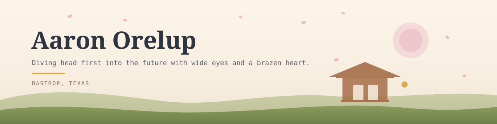

<picture>
  <source media="(prefers-color-scheme: dark)" srcset="assets/banner-dark.svg">
  
</picture>

**Showreel:** [30 seconds, with sound](assets/showreel-30.mp4) · [15-second cut](assets/showreel-15.mp4). Every number in it is real and dated; the motion graphics and the score are code, rendered frame by frame from an HTML canvas timeline.

I learned to code last year. Before May 2025 I had never written software, used git, opened VS Code, or typed anything into a terminal. I taught myself Python and the rest of it alone, because I could see how powerful AI was getting and I wanted to build real things with it — and you can't do that without the basics first.

The two projects I'm proudest of are pinned below. **WordHord** is the one I'd want help with. It's a language-learning tool and I think it could genuinely be useful to people trying to learn a language, which matters more to me than anything else here. **LLM Monster Hunter** is mostly how I learned to build software at all, but I'd be glad of help there too if you want to make it stranger or more fun. Everything else on this account is receipts for things I've written about in [the ledger](https://aaronorelup.com).

<b>My day job</b>

 

Part-time remote data and systems work for **AERI**, an electronic-component brokerage in Costa Mesa. SQL Server, Power Query, Python, Excel automation — executive dashboards, reporting pipelines, vendor scrapers, and whatever breaks before an audit deadline. I'm also their informal AI advisor.

I'm applying to the **JET Program** to teach English in Japan starting fall 2027. That's the actual plan; AERI funds it and gives me room to keep building in the meantime.

<b>How I actually work</b>

 

I have an Anthropic Max 20x subscription and I code with Claude Code. Almost everything on this account was built that way.

Lately I've been working in bursts: instead of one agent editing files while I watch, I cast out a large fleet of agents orchestrated by Fable 5 agents, aimed at one very specific long-horizon task. Then I read what came back. It trades frequent small corrections for fewer, much larger review sessions, and it only works if the task is scoped tightly enough up front.

The small projects are the test rigs. Grind & Grimoire, Armies of Gielinor, BLACKWATER — each one was me trying a different orchestration loop to see where it broke before pointing it at something I care about.

<b>Milestones</b>

 

**2025-05-03 — MyLLMServer.** The first code I ever wrote. A Flask server running a local GGUF model on my own GPU. I didn't know git, VS Code, Python, or the terminal when I started it. I picked a project that needed all four.

**2025-05-05 — my-llm-android-app.** A Kotlin Android client for that server, two days later. Harder than the server by a wide margin, and I was still a complete beginner. Streaming responses to a phone from a model running in my bedroom.

**2025-06-08 — LLM Monster Hunter begins.** One month after writing my first line of code, I started a monster-catching RPG where every creature is written and painted at play time. In hindsight this was not a reasonable second month.

**2025-08-23 — LLM Monster Hunter's core backend architecture lands.** A generation queue, a workflow system, a backend event registry, and a schema that stopped fighting me. 366 commits in eleven weeks. This is where I stopped copying patterns and started choosing them.

**2026-07-05 — the computed state registry.** I ripped out the frontend's state handling and rebuilt it around a computed registry driven by domain events. Monster cards started patching themselves in place instead of refetching. The hardest refactor I've done, and I did it before writing a single new feature.

**2026-07-09 — WordHord goes public.** Started on my machine days earlier. Local-first language learning: it tracks what you know word by word and builds reading, listening, and cloze exercises against that map. Nothing leaves your computer.

**2026-07-10 — WordHord's major features are done.** Every room playable, multi-language working for real, per-language media isolation, lint-clean, documented. From first file to feature-complete in about a week.

**Late July 2026 — Grind & Grimoire.** A skateboarding wizard in Venice Beach, generated from a single prompt in one evening. The first one-shot where what came out matched what I had pictured — not approximately, exactly. That's the run that convinced me this approach was real.

**2026-08-02 — the ledger.** I started publishing what I was learning instead of keeping it in my own notes. Failures included, in order.

**2026-08-04 — WordHord becomes modular.** Rooms and languages migrated to real modules: a language owns its rooms, its tables, and its rulebook, so adding a new one doesn't mean touching the core. Ten planned steps, all of them landed, plan retired.

**2026-08-05 — LLM Monster Hunter's major deliverables are complete.** A playtest harness that plays the game without me, adversarial probes, gauntlets running in CI, a cost ledger. The game now tests its own storytelling.

**2026-08-07 — Armies of Gielinor.** A game Jagex killed in 2018, rebuilt from screenshots. Really it was the first time I ran a gauntlet loop end to end, and the game was the thing I pointed it at.

